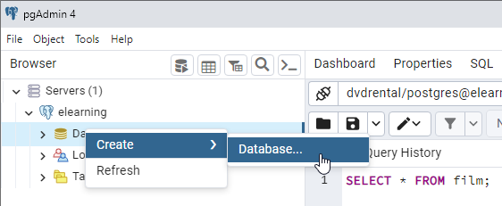
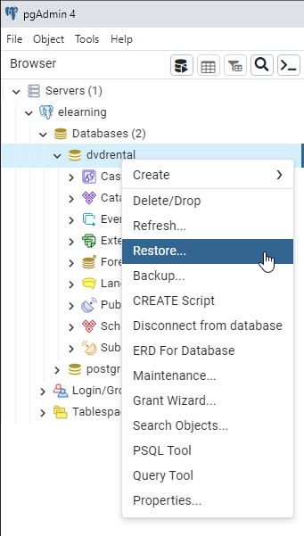
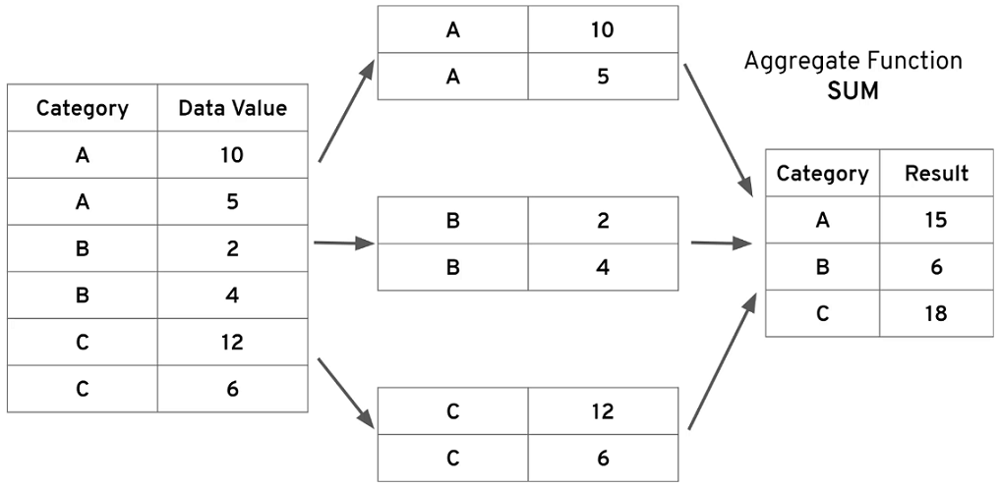
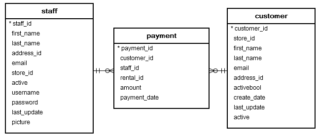
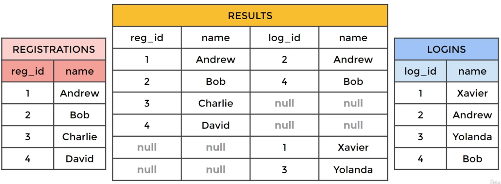
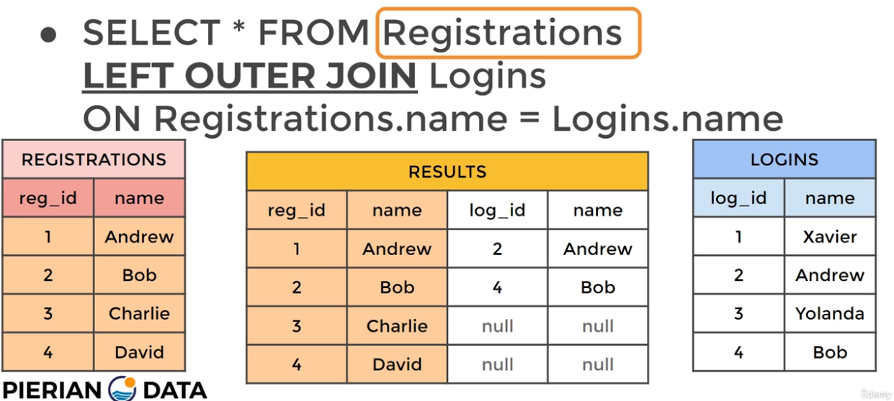

# The Complete SQL Bootcamp: Go from Zero to Hero

## Introduction

There are 5 components of the SQL language:

- DDL: data definition language, such as CREATE, ALTER, DROP
- DQL: data query language, such as SELECT
- DML: data manipulation language, such as INSERT, UPDATE, DELETE
- DCL: data control language, such as GRANT, REVOKE
- TCL: transaction control language, such as COMMIT, ROLLBACK 

The content of this note is only about: (a bit) DDL, (a bit) DML, and (a lot) DQL.

## Set Up Environment

- Install PgAdmin 4
- After downloading ``dvdrental.tar``, you need to restore it by doing so





- Fill in necessary information related to ``dvdrental.tar``
- Open `Query Tool` and perform `SELECT * FROM film;` to make sure everything works

## SQL Statement Fundamentals

### ``SELECT``

Syntax

```sql
SELECT col_1, col_2 FROM table_a;
```

### ``WHERE``

The `WHERE` statement allows us to specify conditions on columns for the rows to be returned.

``` sql
SELECT column1, column2
FROM tableX
WHERE conditions;
```

A table of **Comparision Operators**

Operator            | Description
--------------------|-------------------------
 =                  | Equal
 ``>``              | Greater than
 ``<``              | Less than
 ``>=``             | Greater than or equal to
 ``<=``             | Less than or equal to
 ``<>`` or ``!=``   | Not equal to

**Logical Operators** allows us to combine mutiple comparision operators

- **AND**
- **OR**
- **NOT**

### ``ORDER BY``

The syntax

```sql
SELECT col1, col2 WHERE condition ORDER BY col1 ASC/DESC;
```

### ``LIMIT``

``LIMIT`` is useful when comming along with ``ORDER BY``.

### ``BETWEEN`` and ``NOT BETWEEN``

The ``BETWEEN`` operator (inclusive) can be used to match a value against a range of values:

- value ``>=`` low ``AND`` value ``<=`` high.
- value ``BETWEEN`` low ``AND`` high.

The ``NOT BETWEEN`` opernator (exclusive)

- value ``<`` low OR value ``>`` high
- value ``NOT BETWEEN`` low ``AND`` high

### ``IN`` and ``NOT IN``

Syntax

```sql
SELECT color FROM a_table WHERE color IN ('red','blue')
```

### ``LIKE`` and ``ILIKE``

- ``LIKE`` operator allows us to perform pattern matching against string data with te use of wildcard characters:
  - ``%`` matches any **sequence of characters**.
  - ``_`` matches any **single character**.
- ``LIKE`` is case-sensitive and ``ILIKE`` is case-insensitive.

## ``GROUP BY`` statement

- The main idea behind an aggregate function is to take multiple inputs and return a single output.
- Aggregate function calls happen only in the ``SELECT`` clause or the ``HAVING`` clause.
- ``GROUP BY`` allows us to aggregate columns **per some category**. That means the values of the column must be **categorical**.
- The ``GROUP BY`` clause must appear right after a ``FROM`` or ``WHERE`` statement.
- In the ``SELECT`` statement, columns must either have an aggregate function or be in the ``GROUP BY`` call.
- ``WHERE`` statement should not refer to the aggregation result, later on we will learn to use ``HAVING`` to filter on those results.
- The ``HAVING`` clause allows us to apply filter on aggregation results. This is because we cannot use ``WHERE`` statement to filter the aggregate functions.

```sql
SELECT category_col, AGG(data_col)
FROM a_table
[WHERE category_col != 'A']
GROUP BY category_col
```



### Example 1

Requirement: Get total amount that each customer has spent.

```sql
SELECT customer_id, SUM(amount)
FROM payment
GROUP BY customer_id
ORDER BY SUM(amount)
```

## ``JOIN``

### INNER JOIN

- An ``INNER JOIN`` will result with the set of records that **match in both** tables.

``` sql
SELECT * FROM TableA
INNER JOIN TableB
ON TableA.col_match = TableB.col_match;
```



### ``OUTER JOIN``



``` sql
SELECT *
FROM TableA
FULL OUTER JOIN TableB
ON TableA.col_match = TableB.col_match;
```

- A ``LEFT|RIGHT OUTER JOIN`` results in the set of records that are in the left table, if there is no match with the right table, the results are null.



``` sql
SELECT *
FROM TableA
LEFT OUTER JOIN TableB
ON TableA.col_match = TableB.col_match;
```

### ``UNION``

- The ``UNION`` oprator is used to combine the result-set of two or more SELECT statements.
- It basically serves to directly concatenate two results together, essentially "pasting them together".

```sql
SELECT column_name FROM TableA
UNION
SELECT column_name FROM TableB;
```

## Advanced Topics

### Timestamps and EXTRACT

- time-based data types: TIME, DATE, TIMESTAMP, TIMESTAMPTZ
- functions: TIMEZONE, NOW, TIMEOFDAY, CURRENT_TIME, CURRENT_DATE
- extraction of information from a time-based data type
  - ``EXTRACT()``: ``EXTRACT(YEAR FROM date_col)``
  - ``AGE()``: how old the timestamp is, ``AGE(date_col)``
  - ``TO_CHAR()``: ``TO_CHAR(date_col, 'mm-dd-yyyy')``

### Sub-query

- A sub query allows you to construct complex queries, essentially performing a query on the reults of another query.

``` sql
SELECT column_name
FROM table_name
WHERE EXISTS
(SELECT column_name FROM
table_name WHERE condition);
```

### Self-Join

- A self-join is a query in which a table is joined to itself.

```sql
SELECT tableA.col, tableB.col
FROM table AS tableA
JOIN table AS tableB
ON tableA.some_col = tableB.other_col;
```

- Example 1

Suposedly, we have the table of ``employee``

emp_id        | name     | report_id
--------------|----------|---------
 1            | Andrew   | 3
 2            | Bob      | 3
 3            | Charlie  | 4
 4            | David    | 1

**Requirement**: Show the employee name and their reports recipient name.

```sql
SELECT emp.name, rep.name as recipient
FROM employee as emp
JOIN employee as rep
ON emp.emp_id = rep.report_id
```

- Example 2

**Requirement**: Show pairs of films that have the same length

```sql
SELECT f1.title, f2.title, f1.length
FROM film AS f1
JOIN film AS f2
ON f1.film_id != f2.film_id AND f1.length = f2.length;
```

## Creating Databases and Tables

- General syntax of creating a table

```sql
CREATE TABLE table_name (
  column_name TYPE column_constraint,
  column_name TYPE column_constraint,
  table_constraint table_constraint
) INHERITS existing_table_name;
```

- Constraints can be divided into two main categories: Column Constraints and Table Constraints
- Couple of examples: NOT NULL, UNIQUE, PRIMARY KEY, FOREIGN KEY, CHECK, EXCLUSION, REFERENCES

```sql
CREATE TABLE employee(
  employee_id SERIAL PRIMARY KEY,
  first_name VARCHAR(50) NOT NULL,
  last_name VARCHAR(50) NOT NULL,
  birthdate DATE CHECK (birthdate > '1900-01-01')
  hire_date DATE CHECK (hire_date > birthdate),
  salary INTEGER CHECK (salary > 0)
);
```

## Conditional Expressions and Operators

### ``CASE``

- ``CASE`` statement is very similar IF/ELSE

```sql
CASE
  WHEN condition1 THEN result1
  WHEN condition2 THEN result2
  ELSE some_other_result
END
```

```sql
SELECT customer_id
CASE
  WHEN (customer_id <= 100) THEN 'Premium'
  WHEN (customer_id BETWEEN 100 AND 200) THEN 'Plus'
  ELSE 'Normal'
END
FROM customer;
```

```sql
SELECT

FROM film;
```

### ``COALESCE``

- ``COALESCE`` function accepts an unlimited number of arguments. It returns the first argumrnt that is not null. If all arguments are null, the ``COALESCE`` function will return null.

### CAST

- ``SELECT CAST('5' AS INTEGER)``
- ``SELECT '5'::INTEGER``

## References

1. https://www.sqltutorial.org/sql-cheat-sheet/
2. https://www.postgresqltutorial.com/
3. https://learnsql.com/blog/sql-basics-cheat-sheet/
4. https://learnsql.com/blog/sql-join-cheat-sheet/
5. https://www.pgadmin.org/docs/pgadmin4/development/backup_and_restore.html
6. https://blog.codinghorror.com/a-visual-explanation-of-sql-joins/
7. https://en.wikipedia.org/wiki/Join_(SQL)
8. https://www.linkedin.com/posts/alexxubyte_systemdesign-coding-interviewtips-activity-7046145129413255168-VvqB?utm_source=share&utm_medium=member_desktop