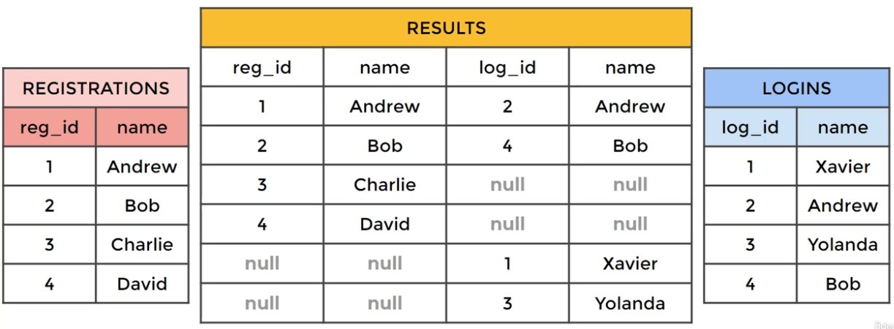

# JOIN

JOIN allows us to combine information from multiple tables, defined by the join type: INNER/OUTER/CROSS and LEFT/RIGHT/FULL, i.e. INNER JOIN, LEFT OUTER JOIN, RIGHT OUTER JOIN, and FULL OUTER JOIN (the INNER and OUTER keywords are optional).

[An example of schema](#schema-example) where the JOIN could come into play.

## INNER JOIN

* An ``INNER JOIN`` will result with the set of records that **match in both** tables that has the following syntax.

``` sql
SELECT * FROM TableA
INNER JOIN TableB
ON TableA.col_match = TableB.col_match;
```

## OUTER JOIN

There are three types of ``OUTER JOIN``: ``FULL OUTER JOIN``, ``LEFT OUTER JOIN``, and ``RIGHT OUTER JOIN``.

### FULL OUTER JOIN

A ``FULL OUTER JOIN`` or simply ``OUTER JOIN`` will give you the union of A and B, i.e., all the rows in A and all the rows in B. If something in A doesn't have a corresponding datum in B, then the B portion is null, and vice versa, [for example](#outer-join-example).

``` sql
SELECT *
FROM TableA
FULL OUTER JOIN TableB
ON TableA.col_match = TableB.col_match;
```

### LEFT OUTER JOIN (similar to RIGHT OUTER JOIN)

A ``LEFT OUTER JOIN`` results in the set of records that are **in the left table**, if there is no match with the right table, the results are null, [for example](#left-outer-join-example).

``` sql
SELECT *
FROM TableA
LEFT OUTER JOIN TableB
ON TableA.col_match = TableB.col_match;
```

## UNION

* The ``UNION`` oprator is used to combine the result-set of two or more ``SELECT`` statements.
* It basically serves to directly concatenate two results together, essentially "pasting them together".

```sql
SELECT column_name FROM TableA
UNION
SELECT column_name FROM TableB;
```

## Appendix

### Schema Example


### OUTER JOIN Example



### LEFT OUTER JOIN Example


## References

1. [SQL JOIN Cheat Sheet](https://learnsql.com/blog/sql-join-cheat-sheet/)
