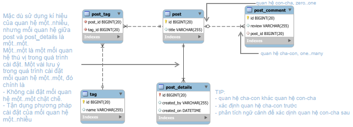

# Practical Association Setup

* This document give a brief look on the way of managing assoiciations between tables.
* In practical, we are interested in three most common associations: **one-to-many**, **one-to-one**, **and many-tomany**. These kinds of associations represent the relationships between the entities being taken into account during development.
* All the setup of associations will be discussed from the database perspective.



## one-to-many Association

We can set up a one-to-many association by introducing a **foreign key constraint** between two tables.

```sql
CREATE TABLE post (
 id SERIAL PRIMARY KEY,
 title VARCHAR(1024) NOT NULL UNIQUE
);

CREATE TABLE post_comment (
 id SERIAL PRIMARY KEY,
 review VARCHAR(1024),
 post_id INT NOT NULL,
 CONSTRAINT fk_post 
  FOREIGN KEY(post_id) 
  REFERENCES post(id)
  ON DELETE CASCADE
);
```

## one-to-one Association

From a database perspective, the strict one-to-one association is based on a foreign key that’s constrained to be unique. ``DEFERABLE`` comes into play!

``` sql
CREATE TABLE post (
 id SERIAL PRIMARY KEY,
 title VARCHAR(1024) NOT NULL
);

CREATE TABLE post_detail(
 id BIGINT PRIMARY KEY,
 created_by VARCHAR(512) NOT NULL UNIQUE,
 created_on TIMESTAMP WITHOUT TIME ZONE DEFAULT (CURRENT_TIMESTAMP AT TIME ZONE 'utc')
);

ALTER TABLE post
 ADD FOREIGN KEY (id) REFERENCES post_detail(id)
  DEFERRABLE INITIALLY DEFERRED;
  
ALTER TABLE post_detail
 ADD FOREIGN KEY (id) REFERENCES post(id)
  DEFERRABLE INITIALLY DEFERRED;
```

However, to ease the implementation, we could leverage the one-to-many association setup and the database setup should be like

```sql
CREATE TABLE post (
 id SERIAL PRIMARY KEY,
 title VARCHAR(1024) NOT NULL
);

CREATE TABLE post_detail(
 id SERIAL PRIMARY KEY,
 created_by VARCHAR(512) NOT NULL,
 created_on TIMESTAMP WITHOUT TIME ZONE DEFAULT (CURRENT_TIMESTAMP AT TIME ZONE 'utc'),
 post_id BIGINT NOT NULL UNIQUE,
 CONSTRAINT fk_post
  FOREIGN KEY(post_id)
  REFERENCES post(id)
  ON DELETE CASCADE
);
```

## many-to-many Association

To handle the many-to-many association, we need a junction table that retains the relation between two entities by storing two foreign keys refer to these two entities. The database setup for this association should be like

```sql
CREATE TABLE post (
 id SERIAL PRIMARY KEY,
 title VARCHAR(1024) NOT NULL

CREATE TABLE tag(
 id SERIAL PRIMARY KEY,
 name VARCHAR(32) NOT NULL UNIQUE
);

CREATE TABLE post_tag(
 id SERIAL PRIMARY KEY,
 post_id BIGINT NOT NULL,
 tag_id BIGINT NOT NULL,
 CONSTRAINT fk_post
  FOREIGN KEY(post_id)
  REFERENCES post(id)
  ON DELETE CASCADE,
 CONSTRAINT fk_tag
  FOREIGN KEY(tag_id)
  REFERENCES tag(id)
  ON DELETE CASCADE
);
```

## References

1. [PostgreSQL - One-To-One - which approach is "better"? [closed]](<https://stackoverflow.com/a/63990966/5657159>)
